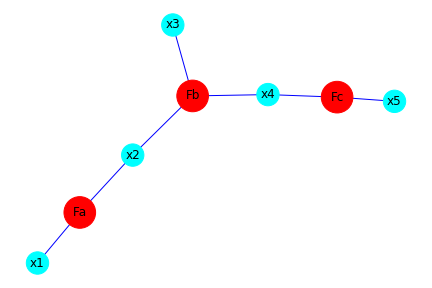

# Forney Factor graph

### Assumptions:
 - Random variables in the Factor graph are boolean Random variables
 - There is no leaf Factor, but only leaf variables
 - In order to use Equality node, the user should define it as a factor and link variables
 - The ids or name for the factors and variables are unique

## Factor graph generation

### Sample Factor graph


### Importing modules

```
from Factor_graph import Factor_graph
from Factor import Factor
from Edge import Edge
from Inference import Inference
import numpy as np
```
### Creating factor

 - To create a factor node, create an instance of Factor class
 ```
fa = Factor()
fb = Factor()
fc = Factor()
 ```

 - Add Unique name or id and factor weight to the created instance

 ```
 #add_factor(name, weight)

fa.add_factor("Fa", 10)
fb.add_factor("Fb", 2)
fc.add_factor("Fc", 1) 
 ```

### Creating variable

- To create variable as edge, create an instance of Edge class with unique variable name or id

```
# Edge(var_name)

x1 = Edge("x1")
x2 = Edge("x2")
x3 = Edge("x3")
x4 = Edge("x4")
x5 = Edge("x5")
```

### Linking Variables to factor

- To link variables and the corresponding factor, use the Factor class method `link_variables`, which takes argument as dictionary

```
#link_variables({"incoming":[<linked_incoming_variable_instances>],"outgoing":[<linked_outgoing_variable_instances>]})

fa.link_variables({"incoming":[x1], "outgoing":[x2]})
fb.link_variables({"incoming":[x2, x3], "outgoing":[x4]})
fc.link_variables({"incoming":[x4], "outgoing":[x5]})
```

### Linking factor to variables

- To link variables to respective factors, use the Edge class method `add_edge`, which takes 2 arguments

```
#add_edge(preeceding or parent factor, succeeding or child factor)
#For Half edges None can be passes instead of parent or child factor
#In the below case, x1, x3, x5 are half edges

x1.add_edge(None, fa)
x2.add_edge(fa, fb)
x3.add_edge(None, fb)
x4.add_edge(fb, fc)
x5.add_edge(fc, None)
```

### Adding distribution to variables

- To add distribution to variables, use the Edge class method `add_distribution`
- Current implementation is tested only for boolean random variables and so distribution is of shape (1, 2)

```
#add_distribution(numpy_array)

x1.add_distribution(numpy.array([0.5, 0.5]))
```

### Factor to variable message:

- When the factor graph is created, factor to variable message will be 1
- Atrribute for this message is `Factor.fac_2_var_message`
- It will get updated during inferencing

### variable to Factor message:

- When the factor graph is created, variable to Factor message will be 1
- Attribute for this message is 'Edge.var_2_fac_message
- It will get updated during inferencing

## Inferencing:

### Infering a variable from the graph

- To infer a variable from the graph, first create an instance of Inference class

```
s=Inference()
```

- Then call the method `infer_variable`, which takes argument as variable instance which is querried

```
s.infer_variable(x4)
```

### Visualising a factor

- To visualise the factor node values in the factor graph, use the method `print_factor` which takes argument as factor instance

```
s.print_factor(fa)
```

### Visualising a variable

- To visualise the variable edge values in the factor graph, use the method `print_variable` which takes argument as variable instance

```
s.print_variable(x4)
```

### Graph Visualisation

- To visualize the created factor graph use the method `print_graph` and it takes no arguments

```
s.print_graph()
```

#### Generated Graph

- Factors are represented by Red colored nodes and the variables attached to the edge connecting the factors are represented by blue nodes between factors

